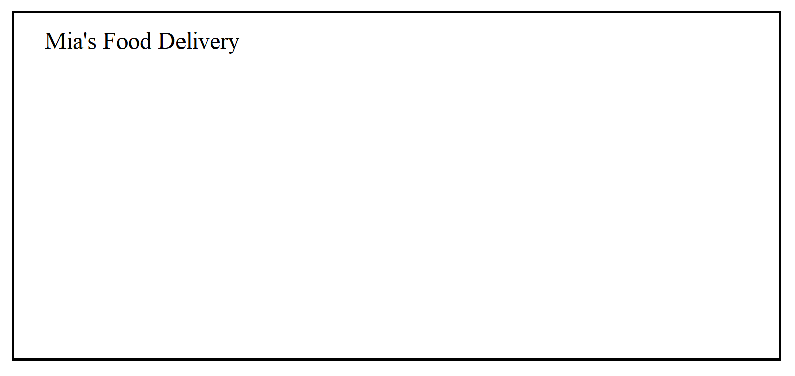

# Website Plan
Here are the pages that I want to make
* Home Page
* Restaurant Page
* Checkout
* Confirmation

## Home Page
Details about the home page  

LOGIN :
PASSWORD:
ADDRESS:

- **chinese inspired dishes**
    - sweet and sour chicken $14.50 
      - (smaller font: white rice, assorted veggies, french fries)
    - spicy noodles $15
      - (smaller font: white rice, assorted veggies, french fries)
    - fried green beans $8 
      - (smaller font: white rice)

- **Soul Food**
    - fried chicken $14.50 
      - smaller font: white rice, assorted veggies, french fries
    - turkey plate $15 
      - smaller font: white rice, assorted veggies,french fries
    - vegan sides $8 
      - smaller font: white rice, assorted veggies, french fries, mac and cheese smaller font (+1.50)

- **dessert**
  - banana pudding $7.50
  - red velvet cake $7.50
  - shaved ice $5.75

## Checkout
see your cart button ( shaped like a take out bag to be cute , in the future id want it to smile or steam up when you hover your mouse over it )

### Your Order
QUESTION: how will i code it to show peoples orders oh snap haha

EX: 
- spicy noodles $14.50 ( ordered:1)
  - (smaller font: w/assorted veggies)
- fried green beans $8 (ordered:1)
  - (smaller font: w/ white rice)
- banana pudding $7.50 (ordered:1)

### Promo code or coupon 

### order amount 
QUESTION: HOW TO ADD SOMETHING TO CALCULATE ORDERS?  
EX: $30.00

## Confirmation
YOUR ORDERING :  
EX: 
- spicy noodles $14.50 ( ordered:1)
- fried green beans $8 (ordered:1)
  - (smaller font: w/ white rice)
- banana pudding $7.50 (ordered:1)

### Estimated wait time 

### Location of pickup/delivery ?

CONFIRM BUTTON : 

